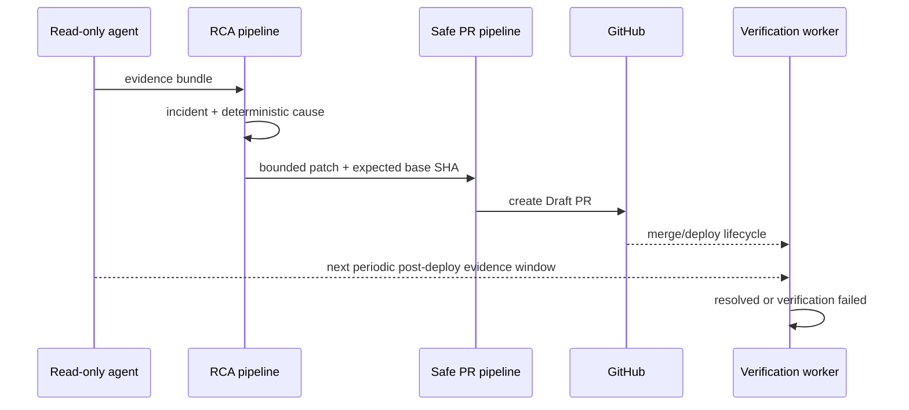

# Golden Path

이 도구는 Kubernetes 장애 증거를 보존하고 제한된 변경안을 GitOps Draft PR로 제안한 뒤 배포 결과를 다시 검증합니다.

## ImagePullBackOff 완결 흐름

| 단계 | 입력 | 결정 또는 산출물 | 실패 시 |
|---|---|---|---|
| 1. 증거 수집 | read-only agent의 Pod, container state, Event | correlation ID가 붙은 불변 evidence bundle | 불완전 증거로 기록 |
| 2. 사건 탐지 | `ImagePullBackOff`, `ErrImagePull` | 대상 cluster/namespace/workload가 고정된 incident | 대상이 모호하면 중단 |
| 3. 결정론적 RCA | Event message와 catalog signal | `wrong_image_tag`, `missing_image_pull_secret`, `registry_unavailable` 등의 근거별 후보 | signal이 부족하면 `insufficient_evidence` |
| 4. 수정안 제한 | GitOps manifest, source digest, 현재 base SHA | 허용된 image scalar의 forward/inverse patch | 경로·SHA·단일 대상이 불명확하면 중단 |
| 5. Draft PR | GitHub repository와 base branch | base SHA가 고정된 Draft PR | base가 전진하면 stale 처리 후 재계산 |
| 6. 재검증 | merge/deploy 이벤트와 새 evidence window | ImagePullBackOff 소멸, Pod Ready 회복, 대상 동일성 기록 | deadline 내 회복하지 않으면 verification failed |

`wrong_image_tag`만 자동 제안 가능한 대표 경로입니다. Secret 생성, registry mirror 전환, 클러스터 명령은 정책으로 추론하지 않고 운영자 검토 항목으로 남깁니다.

## 불변 조건

- 증거는 수집 당시 cluster, namespace, resource identity와 함께 저장합니다.
- RCA는 LLM 출력이 아니라 versioned YAML rule과 정확한 signal match로 결정합니다.
- patch는 repository, branch, manifest path, base SHA, source SHA-256을 모두 가져야 합니다.
- PR 생성 전에 원본 scalar가 예상값과 같은지 다시 확인합니다.
- merge는 도구의 권한 밖입니다. Draft PR을 만들고 lifecycle event만 관측합니다.
- 검증은 변경 전 evidence와 변경 후 evidence를 같은 대상 identity로 비교합니다.

## 주요 이벤트



agent는 제어면의 변경 명령을 받지 않고 설정된 cadence로 계속 수집합니다. verification은
배포 성공 뒤 시작 시각보다 오래된 window를 거부하고 이후에 수집된 evidence만 변경 전
기준선과 비교합니다.

## 안전장치 구현 감사

| # | 상태 | 코드 강제 | 회귀 테스트 |
|---|---|---|---|
| 1. evidence Kubernetes 권한 read-only | 구현됨 | [`agent-rbac.yaml`](../charts/opsia/templates/agent-rbac.yaml)은 `get/list/watch`만 부여하고 [`kubernetes_providers.py`](../src/services/target/cluster-agent/providers/kubernetes_providers.py)는 Kubernetes API read만 수행. [`manifest-check.sh`](../scripts/manifest-check.sh)는 mutation verb, wildcard, exec/attach/port-forward/proxy를 거부 | [`test_agent_kubernetes_surface_is_read_only`](../tests/test_golden_path_safety_contracts.py), `make manifest-check` |
| 2. 전 구간 Correlation ID | 구현됨 | [`envelope.py`](../src/packages/events/envelope.py)가 root correlation을 만들고 [`dispatch.py`](../src/packages/runtime/dispatch.py)가 모든 child event에 같은 correlation과 parent causation을 강제. PR·merge·verification lifecycle은 저장된 correlation으로 발행 | [`test_worker_child_event_inherits_correlation_and_causation`](../tests/test_golden_path_safety_contracts.py), [`test_signed_exact_merge_moves_only_tracked_pr_to_deploy_pending`](../tests/test_recovery_pr_lifecycle.py) |
| 3. incident·PR 멱등성 | 구현됨 | [`worker.py`](../src/packages/runtime/worker.py)의 `(event_id, consumer)` 처리 ledger, [`IncidentSignalClaim`](../src/domains/rca/models.py)의 workspace/cluster/signal unique 제약, [`github_provider.py`](../src/services/gitops/scm-worker/github_provider.py)의 approval-scoped branch와 exact open Draft PR 재사용 | [`test_incident_claim_has_a_durable_unique_identity`](../tests/test_golden_path_safety_contracts.py), [`test_same_active_alert_reuses_claim_across_enriched_evidence_windows`](../tests/test_incident_signal_identity.py), [`test_existing_pr_remains_idempotent_after_base_advances`](../tests/test_safe_pr_structured_base_advance.py) |
| 4. resource/path/field allowlist | 구현됨 | [`source_patch.py`](../src/domains/gitops/source_patch.py)가 Deployment, 안전한 repository path, 지원 action과 exact scalar field/value/inverse rollback만 허용. [`dispatch.py`](../src/services/ai/agent/recovery/dispatch.py)가 GitOps 권위 snapshot에서만 patch를 구성 | [`test_patch_allowlist_rejects_non_deployment_and_unapproved_field`](../tests/test_golden_path_safety_contracts.py), [`test_extra_actionable_change_in_target_workload_fails_closed`](../tests/test_recovery_merge_scope.py), [`test_same_target_overlay_replica_patch_blocks_base_edit`](../tests/test_recovery_kustomize_edit_source.py) |
| 5. PR 직전 base SHA 재확인 | 구현됨 | [`GithubScmProvider.create_or_reuse_pr`](../src/services/gitops/scm-worker/github_provider.py)가 branch/file 준비 뒤 base ref를 다시 읽고 처음 검증한 SHA와 다르면 PR POST 전에 중단 | [`test_base_sha_is_rechecked_immediately_before_draft_pr_creation`](../tests/test_safe_pr_structured_base_advance.py), [`test_advanced_base_with_changed_target_scalar_fails_closed`](../tests/test_safe_pr_structured_base_advance.py) |
| 6. 클러스터 직접 변경 차단 | 구현됨 | cluster-agent에는 command/mutation channel이 없고, Safe PR policy는 `pull_request` 외 delivery를 거부. SCM provider의 base branch direct commit 경로를 제거 | [`test_safe_pr_rejects_direct_delivery_and_provider_has_no_merge_path`](../tests/test_golden_path_safety_contracts.py), [`test_recovery_safe_pr_always_uses_pull_request_delivery`](../tests/test_recovery_safe_pr_copy.py), `make manifest-check` |
| 7. 자동 merge 불가 | 구현됨 | [`github_provider.py`](../src/services/gitops/scm-worker/github_provider.py)는 GitHub PR 생성 시 `draft: true`를 강제하고 non-Draft 응답·기존 PR을 거부하며 merge API를 호출하지 않음. [`router.py`](../src/domains/gitops/router.py)는 서명된 외부 merge webhook만 관측 | [`test_unrelated_descendant_change_creates_pr_from_current_base`](../tests/test_safe_pr_structured_base_advance.py), [`test_safe_pr_rejects_direct_delivery_and_provider_has_no_merge_path`](../tests/test_golden_path_safety_contracts.py), [`test_signed_exact_merge_moves_only_tracked_pr_to_deploy_pending`](../tests/test_recovery_pr_lifecycle.py) |
| 8. 배포 후 evidence 재수집·기준선 비교 | 구현됨 | [`rca-feedback-worker`](../src/services/ai/rca-feedback-worker/app.py)가 성공한 exact merge workflow 뒤 verification을 시작하고 다음 주기 evidence window를 소비. [`recovery_verification.py`](../src/domains/rca/recovery_verification.py)가 시작 시각, 대상 identity, pre-recovery SLI/workload/session 기준선을 비교 | [`test_completes_only_after_distinct_continuous_five_minute_windows`](../tests/test_recovery_verification.py), [`test_duplicate_and_stale_windows_do_not_advance_stability_clock`](../tests/test_recovery_verification.py), [`test_missing_pre_recovery_protected_baseline_fails_closed`](../tests/test_recovery_verification.py) |
| 9. 실패 원인·원본 증거 보존 | 구현됨 | [`SafePrFailedBody`](../src/domains/scm/events.py)와 recovery lifecycle이 reason code·stage·evidence ref를 보존. [`dead_letter.py`](../src/packages/storage/repositories/dead_letter.py)는 원본 event payload/correlation/error를 보존하고 evidence 원문은 correlation별로 저장 | [`test_safe_pr_failure_preserves_original_evidence_reference`](../tests/test_golden_path_safety_contracts.py), [`test_safe_pr_failure_uses_approval_identity_to_preserve_retryable_action`](../tests/test_recovery_retry_state.py), [`test_evidence_expiry_persists_retryable_failure_identity`](../tests/test_recovery_verification.py) |

## 검증

```bash
make demo
uv run pytest -q tests/test_golden_path_safety_contracts.py
uv run pytest -q tests/test_recovery_gitops_authority.py
uv run pytest -q tests/test_safe_pr_structured_base_advance.py
uv run pytest -q tests/test_recovery_verification.py
```
